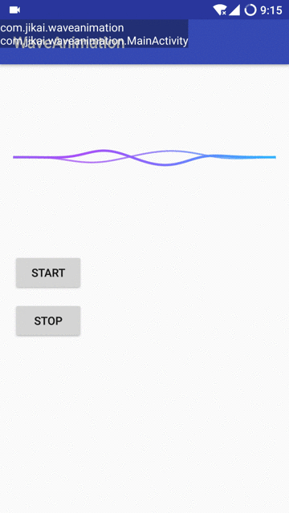

# WaveAnimation

本项目是音量动画基于衰减函数的一种实现方式，函数表达式是y=sin(ax)*(4/(4+x^4))^4，
可以直接将函数粘贴到[这里](https://www.desmos.com/calculator)预览(可能需要FQ)

目前动画效果略显粗糙(结合讯飞语音的音量回调，效果还行，运行在老旧手机上没有明显卡顿、发热)；因为水平有限实在没法进一步优化，仅供各位参考和学习，见笑见笑😝

